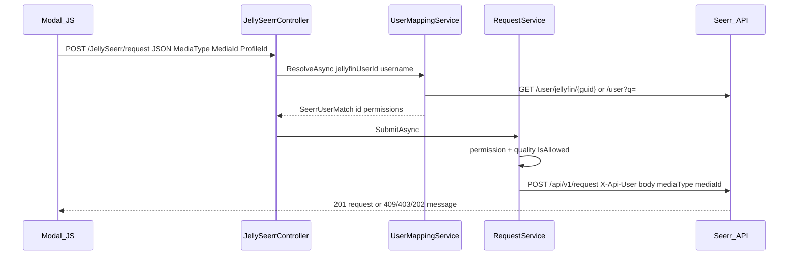
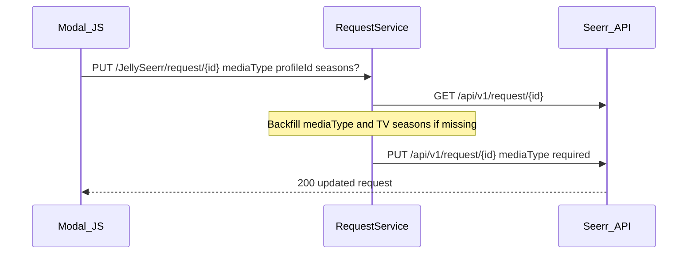
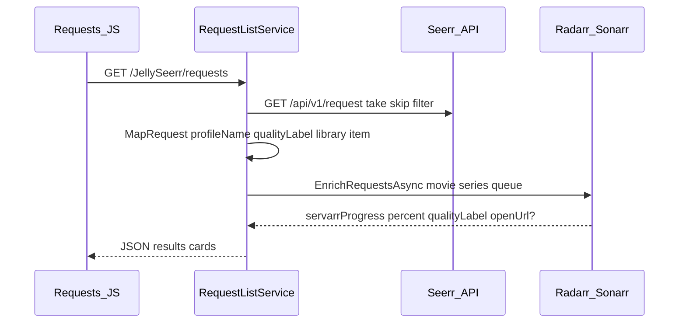

# Architecture

End-to-end design of JellySeerr: how the Jellyfin web client reaches Seerr, Radarr, Sonarr, TMDB, and JustWatch **without** exposing the Seerr admin API key to the browser (except via authenticated plugin proxy routes).

## Layers

```text
┌─────────────────────────────────────────────────────────────┐
│ Jellyfin web (Inject JS/CSS)                                │
│  jellyseerr-tabs.js  ·  jellyseerr-modal.js  ·  requests.js │
│  ApiClient → relative /JellySeerr/...                       │
│  optional: browser → api.themoviedb.org (tmdbApiKey)        │
└────────────────────────────┬────────────────────────────────┘
                             │ session cookie / token
┌────────────────────────────▼────────────────────────────────┐
│ Jellyfin plugin  Jellyfin.Plugin.JellySeerr                 │
│  JellySeerrController  →  Services/*                        │
│  SeerrApiClient (X-Api-Key + X-Api-User)                    │
│  ServarrProgressService, JustWatchQualitiesService, …       │
└──────┬──────────┬──────────┬──────────┬─────────────────────┘
       │          │          │          │
   Seerr/v1   Radarr/v3  Sonarr/v3  TMDB/JW
```

| Layer | Auth | Secrets |
|-------|------|---------|
| Browser → plugin | Jellyfin user session (`[Authorize]`) | No Seerr/Arr keys |
| Plugin → Seerr | `X-Api-Key` (+ `X-Api-User` when mapped) | Server config only |
| Plugin → Arr | `X-Api-Key` | Server config only |
| Browser → TMDB | Key from `client-settings` | Semi-public; restrict in TMDB dashboard |
| Plugin → JustWatch | None (User-Agent only) | — |

## Key types

| Concept | Where |
|---------|--------|
| Seerr user match | [`UserMappingService`](../src/Jellyfin.Plugin.JellySeerr/Services/UserMappingService.cs) — 5‑minute cache |
| Shared Seerr HTTP | [`SeerrApiClient`](../src/Jellyfin.Plugin.JellySeerr/Services/SeerrApiClient.cs) — 30s timeout, auto `/api/v1/` prefix |
| Request payload DTO | [`RequestPayload`](../src/Jellyfin.Plugin.JellySeerr/Model/RequestPayload.cs) — PascalCase + camelCase binders |
| Quality catalog | [`QualityCatalogService`](../src/Jellyfin.Plugin.JellySeerr/Services/QualityCatalogService.cs) — synced into plugin config |
| LAN gate | [`LocalNetworkAccessHelper`](../src/Jellyfin.Plugin.JellySeerr/Helpers/LocalNetworkAccessHelper.cs) |

## Sequence: create request



## Sequence: change request quality (PUT)



OpenAPI and Seerr routes require `mediaType` on PUT. TV updates also need a non-empty `seasons` array (empty → Seerr error: cancel with DELETE instead). See [seerr/requests.md](seerr/requests.md).

## Sequence: Requests tab + Arr progress



`openUrl` is only populated when the LAN gate allows (see [jellyfin/networking.md](jellyfin/networking.md)).

## Sequence: Play button

```mermaid
sequenceDiagram
  participant UI as Modal_JS
  participant Ctrl as Controller
  participant Lib as RequestListService
  participant JF as ILibraryManager

  UI->>Ctrl: GET /JellySeerr/library-item/{mediaType}/{tmdbId}
  Ctrl->>Lib: FindLibraryItemId user mediaType tmdbId
  Lib->>JF: GetItemsResult provider ids Tmdb TheMovieDb
  Lib-->>UI: id N-format or 404
  Note over UI: Hide Play when 404; open item when found
```

Do **not** use unfiltered `ApiClient.getItems` — that historically opened the wrong title.

## Config naming quirk

Product UI says **Seerr**. Plugin config / HTML ids still use `JellyseerrUrl`, `JellyseerrApiKey`, inject files `jellyseerr-*.js`. Treat them as the same integration.

## Related docs

- [permissions.md](permissions.md) — who can do what
- [seerr/overview.md](seerr/overview.md) — Seerr auth headers
- [jellyfin/plugin-apis.md](jellyfin/plugin-apis.md) — full route table
- [AUDIT.md](AUDIT.md) — correctness vs upstream
